# Line Follower Project
**By Geeks Team** _CCSED 26 Level 1_
Final Project
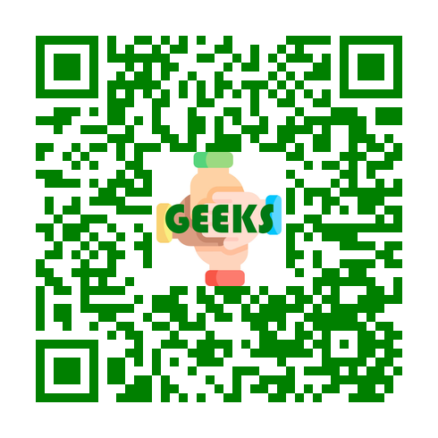

The line follower robot is a robot designed to trace a line on the ground with no physical connection. Our line follower uses a sensor to read the IR rays reflected from the ground to differentiate between the line and other parts on the ground.
The IR sensor reads are recieved by `Arduino Uno` as a microcontroller to control the robot motion and display its state on an `LCD` screen.

## Parts
* Robot Car Acrylic Chassis (2WD)
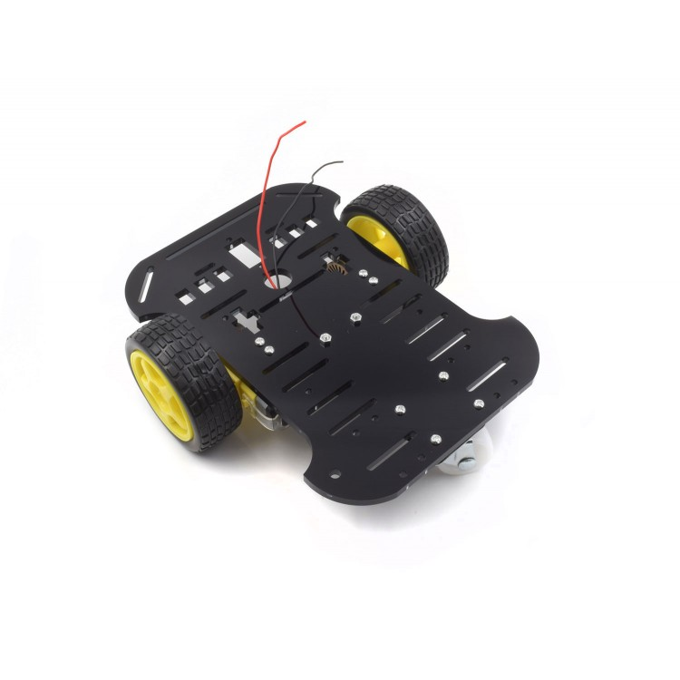
* Arduino Uno
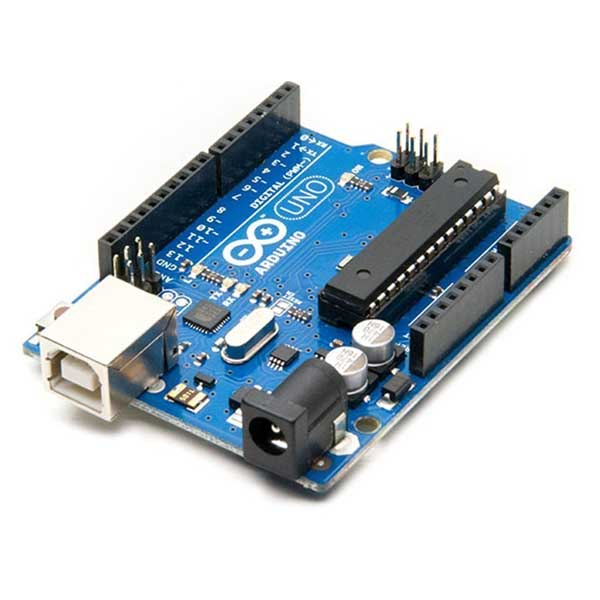
* DC Geared TT Motors (2x)
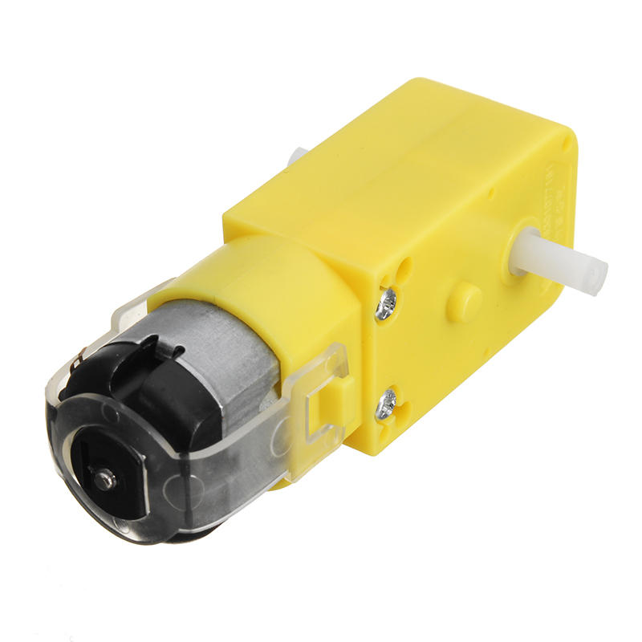
* Motor Driver (Model L298N)
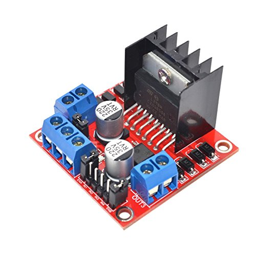
* IR Sensor Modules (3x)
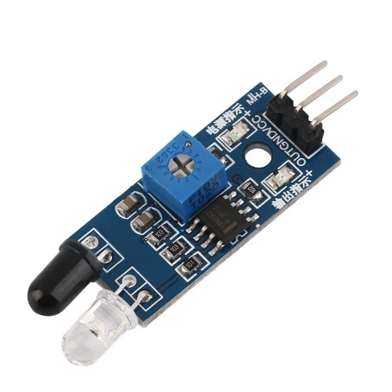
* LCD 16x2 Model
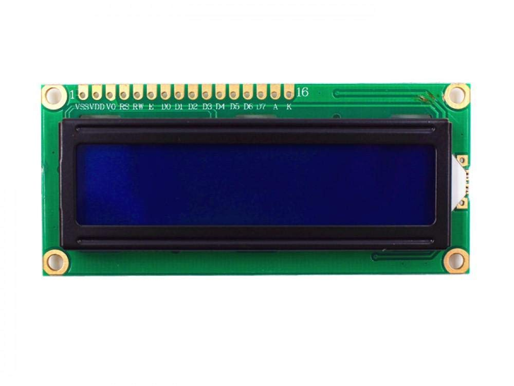
* 18650 Li-on Batteries 3.7V (3x)
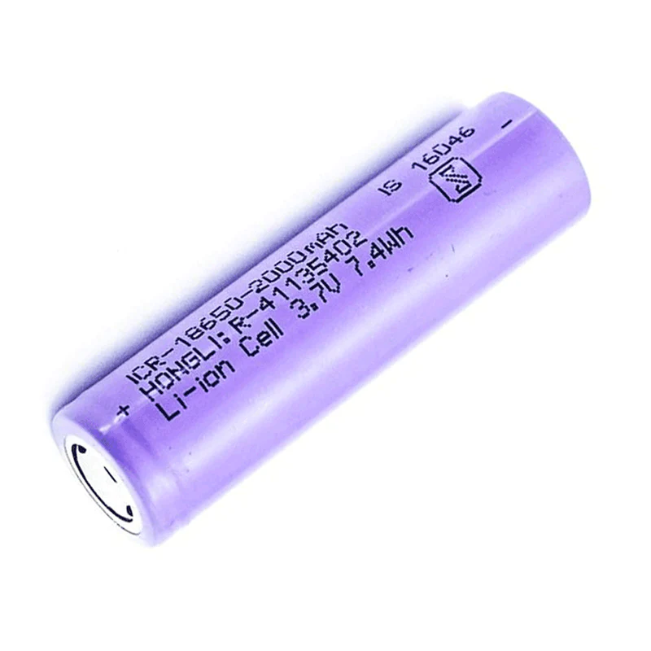
* 18650 3-Cell Battery Holder
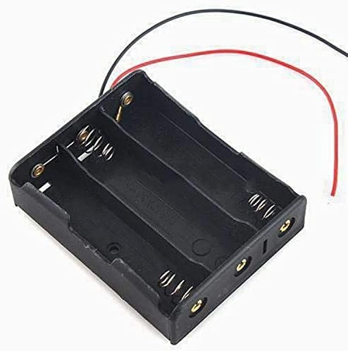
* DC Switch
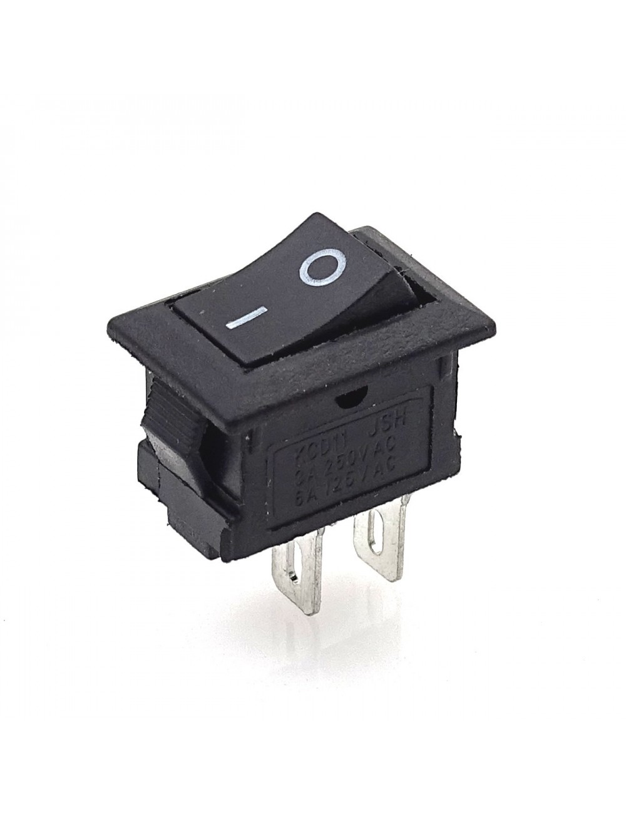
* Jumper Wires
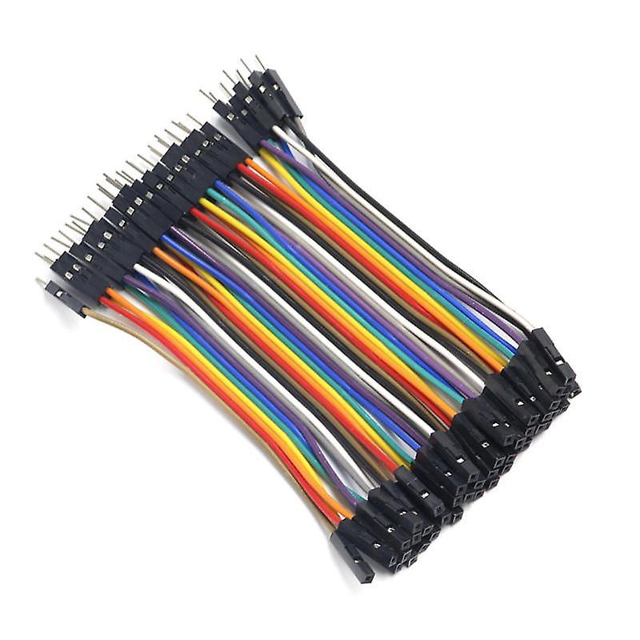

## Procedures

1. Fix all the components on the car chassis using connectors, screws and wax gun
2. Connect components together using jumper wires [As shown in Connections section](#connections)
3. Implement the code and upload it through `Arduino IDE` [As shown in Code section](#code)

## Connections
* DC motors are connected to the Motor Driver and controlled by Arduino
* Reversing the polarity across the DC motor reverses its direction of motion
* Arduino Uno acts as a microcontroller that controls 14 digital i/o pins and 6 analog pins.
* All Components, including Arduino, take their voltage in a parallel connection through the Motor Driver
* The Motor Driver is directly connected to the battery with the switch in the middle

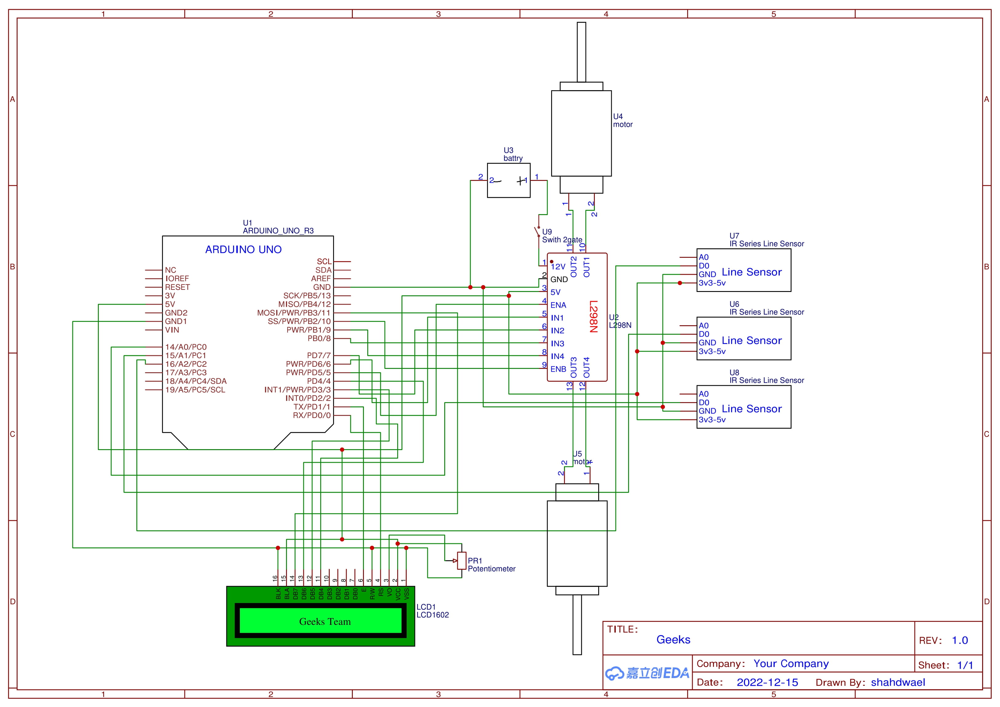
_[To view full diagram click here](./connections/diagram.pdf)_

### (Motor Driver - Arduino) Connections
| Motor Driver | Arduino Uno |
| ------------ | ----------- |
| ENA          | D6          |
| PIN1         | D9          |
| PIN2         | D8          |
| PIN3         | D10         |
| PIN4         | D7          |
| ENB          | D5          |

### (LCD - Arduino) Connections
| LCD | Arduino Uno |
| --- | ----------- |
| RS  | D0          |
| EN  | D1          |
| D4  | D2          |
| D5  | D3          |
| D6  | D4          |
| D7  | D11         |

### Sensors Connected to Arduino
| Sensor | Arduino Uno |
| ------ | ----------- |
| Right  | A0          |
| Middle | A1          |
| Left   | A2          |

## Code

_[To view full code click here](./code/line-follower-code-oop.ino)_

* The code uses Object Oriented Programming models to represent each component as a class, and implement methods and properties connected to it inside these classes.
* The LCD is defined using `LiquidCrystal` library, and `Screen` class has methods to display team name, direction, timer and current area.
* The class `Motor` has methods related to the motion of a single motor.
* The class `Controller` is used to control the car motion through executing methods inside the two motor objects.
* The class `Sensor` has a method to get the reading of the sensor.
* We create an instance of each class at the begining of the program.
* Each class has an `init` function which is executed in the program `setup`.
* Inside `loop`, we get the reading of the 3 sensors and compare them to decide the current car motion using `if ... else if ... else ...` and the execution of functions inside the `Controller` class.